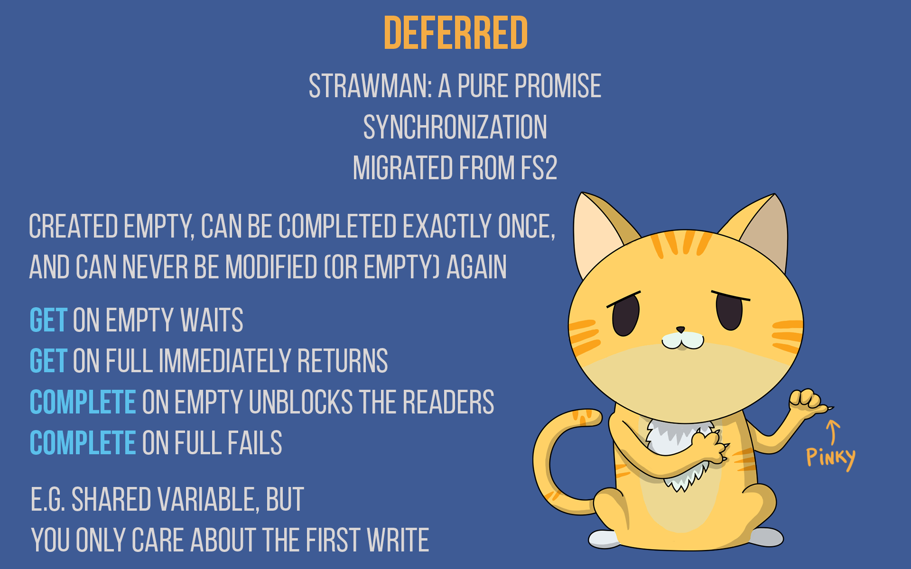

A purely functional synchronization primitive which represents a single value which may not yet be available.

When created, a `Deferred` is empty. It can then be completed exactly once, and never be made empty again.

```scala mdoc:silent
abstract class Deferred[F[_], A] {
  def get: F[A]
  def complete(a: A): F[Unit]
}
```

Expected behavior of `get`

- `get` on an empty `Deferred` will block until the `Deferred` is completed
- `get` on a completed `Deferred` will always immediately return its content
- `get` is cancelable if `F[_]` implements `Concurrent` and if the `Deferred`
  value was built via the normal `apply` (and not via `uncancelable`); and on
  cancellation it will unsubscribe the registered listener, an operation that's
  possible for as long as the `Deferred` value isn't complete

Expected behavior of `complete`

- `complete(a)` on an empty `Deferred` will set it to `a`, and notify any and all readers currently blocked on a call to `get`.
- `complete(a)` on a `Deferred` that has already been completed will not modify its content, and result in a failed `F`.

Albeit simple, `Deferred` can be used in conjunction with `Ref` to build complex concurrent behaviour and data structures like queues and semaphores.

Finally, the blocking mentioned above is semantic only, no actual threads are blocked by the implementation.

### Only Once

Whenever you are in a scenario when many processes can modify the same value but you only care about the first one in doing so and stop processing, then this is a great use case of `Deferred[F, A]`.

Two processes will try to complete at the same time but only one will succeed, completing the deferred primitive exactly once. The loser one will raise an error when trying to complete a deferred already completed and automatically be canceled by the `IO.race` mechanism, that’s why we call attempt on the evaluation.

```scala mdoc:reset:silent
import cats.effect.IO
import cats.effect.concurrent.Deferred
import cats.implicits._
import scala.concurrent.ExecutionContext

// Needed for `start` or `Concurrent[IO]` and therefore `parSequence`
implicit val cs = IO.contextShift(ExecutionContext.global)

def start(d: Deferred[IO, Int]): IO[Unit] = {
  val attemptCompletion: Int => IO[Unit] = n => d.complete(n).attempt.void

  List(
    IO.race(attemptCompletion(1), attemptCompletion(2)),
    d.get.flatMap { n => IO(println(show"Result: $n")) }
  ).parSequence.void
}

val program: IO[Unit] =
  for {
    d <- Deferred[IO, Int]
    _ <- start(d)
  } yield ()
```

## Cancellation

`Deferred` is a cancelable data type, if the underlying `F[_]` is
capable of it. This means that cancelling a `get` will unsubscribe the 
registered listener and can thus avoid memory leaks.

However `Deferred` can also work with `Async` data types, or
in situations where the cancelable behavior isn't desirable.
To do so you can use the `uncancelable` builder:

```scala mdoc:silent
Deferred.uncancelable[IO, Int]
```

The restriction on the `uncancelable` builder is just `Async`,
whereas the restriction on the normal `apply` builder is `Concurrent`.
